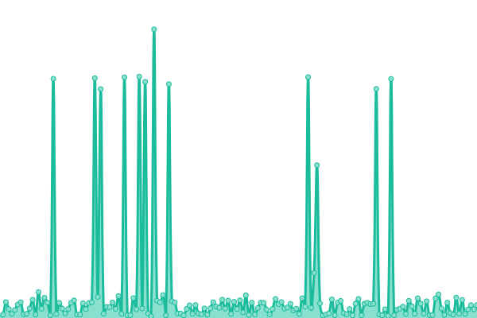

# [📈 Live Status](https://jshwlkr.github.io/upptime): <!--live status--> **🟧 Partial outage**

This repository contains the open-source uptime monitor and status page for [Joshua Walker](https://jshwlkr.info), powered by [Upptime](https://github.com/upptime/upptime).

With [Upptime](https://upptime.js.org), you can get your own unlimited and free uptime monitor and status page, powered entirely by a GitHub repository. We use [Issues](https://github.com/jshwlkr/upptime/issues) as incident reports, [Actions](https://github.com/jshwlkr/upptime/actions) as uptime monitors, and [Pages](https://jshwlkr.github.io/upptime) for the status page.

<!--start: status pages-->
<!-- This summary is generated by Upptime (https://github.com/upptime/upptime) -->
<!-- Do not edit this manually, your changes will be overwritten -->
<!-- prettier-ignore -->
| URL | Status | History | Response Time | Uptime |
| --- | ------ | ------- | ------------- | ------ |
|  [jshwlkr.info](https://jshwlkr.info) | 🟩 Up | [jshwlkr-info.yml](https://github.com/jshwlkr/upptime/commits/HEAD/history/jshwlkr-info.yml) | 

 328ms
     
 | 

<a href="https://jshwlkr.github.io/upptime/history/jshwlkr-info">100.00%</a>
    

|  [Ansible](https://ansible.jshwlkr.info/) | 🟩 Up | [ansible.yml](https://github.com/jshwlkr/upptime/commits/HEAD/history/ansible.yml) | 

 1170ms
     
 | 

<a href="https://jshwlkr.github.io/upptime/history/ansible">100.00%</a>
    

|  [MadeinA2](https://madeina2.com/) | 🟩 Up | [madein-a2.yml](https://github.com/jshwlkr/upptime/commits/HEAD/history/madein-a2.yml) | 

 262ms
     
 | 

<a href="https://jshwlkr.github.io/upptime/history/madein-a2">100.00%</a>
    

|  [PlayYourPride](https://playyourpride.com/) | 🟥 Down | [play-your-pride.yml](https://github.com/jshwlkr/upptime/commits/HEAD/history/play-your-pride.yml) | 

 281ms
     
 | 

<a href="https://jshwlkr.github.io/upptime/history/play-your-pride">58.50%</a>
    

|  [UMSI.club](https://umsi.club/) | 🟩 Up | [umsi-club.yml](https://github.com/jshwlkr/upptime/commits/HEAD/history/umsi-club.yml) | 

 257ms
     
 | 

<a href="https://jshwlkr.github.io/upptime/history/umsi-club">100.00%</a>
    

<!--end: status pages-->

[**Visit our status website →**](https://jshwlkr.github.io/upptime)

## 📄 License

- Powered by: [Upptime](https://github.com/upptime/upptime)
- Code: [MIT](./LICENSE) © [Joshua Walker](https://jshwlkr.info)
- Data in the `./history` directory: [Open Database License](https://opendatacommons.org/licenses/odbl/1-0/)
